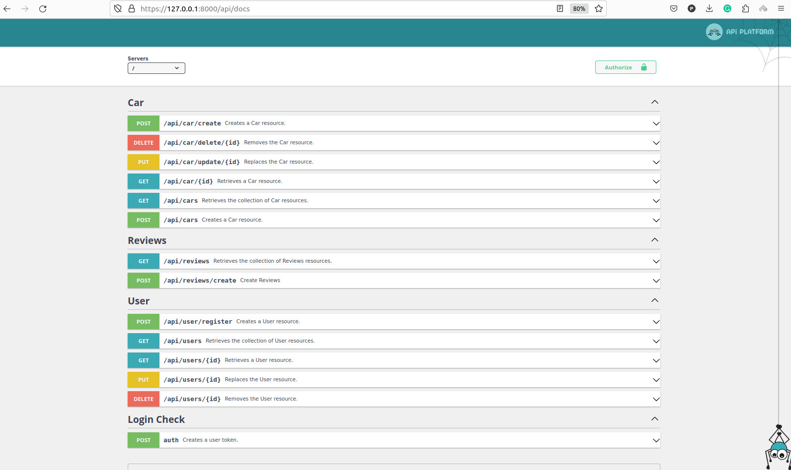
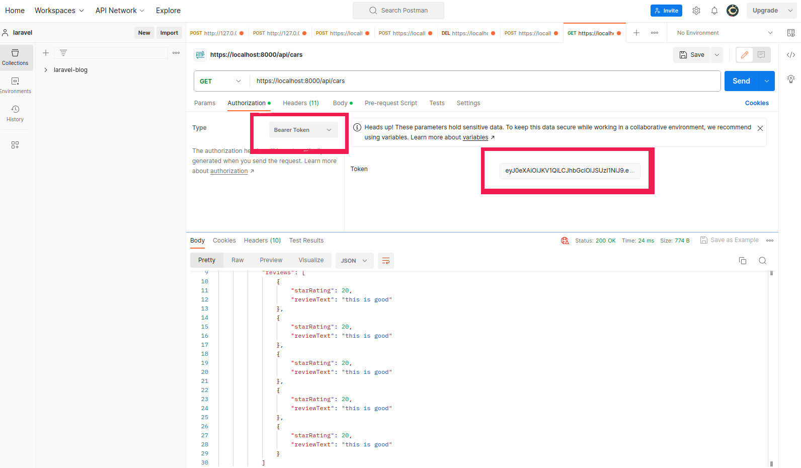

<h1 align="center"></h1>

## Car Reviews API

This is a simple RESTful API that allows you to create, read, update, and delete cars and their reviews. You can also fetch five latest reviews of a given car with a rating above 6 stars.

## Features
<ul>
<li> Create the Car entity with the following fields: brand, model, and color.</li>
<li> Create the Reviews entity with the following fields: star rating (from 1 to 10) and review text.</li>
<li> Implement a simple RESTful API using Symfony 6 and API Platform 3.</li>
<li> Utilize PostgreSQL DB as the database.</li>
<li> Use PHP 8 as the programming language.</li>
<li> Create a dockerized environment for the app.</li>
</ul>

## Install
###1-Symfony Or Composer
Optionally, you can also install Symfony CLI. This creates a binary called symfony that provides all the tools you need to develop and run your Symfony application locally.

The symfony binary also provides a tool to check if your computer meets all requirements. Open your console terminal and run this command:

``symfony check:requirements``

####1-1-Open your console terminal and run any of these commands to create a new Symfony application:

``symfony new my_project_directory --version="6.3.*"``
####1-2 If you're not using the Symfony binary, run these commands to create the new Symfony application using Composer

``composer create-project symfony/skeleton:"6.3.*" my_project_directory``

``cd my_project_directory``

``composer require api``

####1-3 server star
``symfont serve:run -d``

#### More information

1- <a href="https://symfony.com/doc/current/setup.html#creating-symfony-applications">Symfony Getting started</a>

2- <a href="https://api-platform.com/docs/core/getting-started/">Api platform Getting started </a>

###2- Docker
To run this application, you need to have Docker and Docker Compose installed on your machine. Then, follow these steps:
<ul>
<li>Clone this repository to your local machine.</li>
<li>Copy the <code>.env</code> file to <code>.env.local</code> and modify the environment variables according to your needs.</li>
<li>Run <code>docker-compose up -d</code> to build and start the containers.</li>
<li>Run <code>docker-compose exec app php bin/console doctrine:migrations:migrate</code> to create the database schema.</li>
<li>Run <code>docker-compose exec app php bin/console doctrine:fixtures:load</code> to load some sample data (optional).</li>
</ul>

##Usage
You can access the API documentation at http://localhost/docs. You can also use tools like Postman or curl to test the endpoints.

##Authentication
To use the API endpoints, you need to have a valid token. To get a token, you need to register a user and then authenticate with the user credentials.
###1:Register a user
To register a user, you need to send a POST request to <code>/api/user/register</code> with the following JSON body:
<pre>
{
  "email": "user@example.com",
  "plainPassword": "123"
}
</pre>
The response will be a JSON object with the user id and email.

###1-2:Authenticate a user
To authenticate a user, you need to send a POST request to <code>https://localhost:8000/auth</code> with the following JSON body:
<pre>
{
  "email": "user@example.com",
  "password": "string"
}
</pre>
The response will be a JSON object with the token and its expiration time.

###1-3: Use the token

To use the token, you need to add it as a Bearer token in the Authorization header of your requests. For example, if you want to use Postman, you can do the following:
<ul>
<li>In the Authorization tab, select Bearer Token as the type.</li>
<li>Paste the token in the Token field.</li>
<li>Send your request to the desired endpoint.</li>
</ul>

###Here are some examples of requests and responses:
<code>curl http://localhost/api/cars</code>
<pre>
[
    {
        "brand": "strssing",
        "model": "string",
        "color": "string",
        "reviews": [
            {
                "starRating": 12,
                "reviewText": "string"
            }
        ]
    },
    {
        "brand": "strssing",
        "model": "string",
        "color": "string",
        "reviews": []
    },
    {
        "brand": "strssing",
        "model": "string",
        "color": "string",
        "reviews": []
    },
    {
        "brand": "string",
        "model": "string",
        "color": "string",
        "reviews": [
            {
                "starRating": 10,
                "reviewText": "string"
            },
            {
                "starRating": 7,
                "reviewText": "string"
            }
        ]
    }
]

</pre>

<code>curl http://localhost/api/cars/1</code>
<pre>
{
    "brand": "strssing",
    "model": "string",
    "color": "string",
    "reviews": [
        {
            "starRating": 2,
            "reviewText": "string"
        }
    ]
}

</pre>
